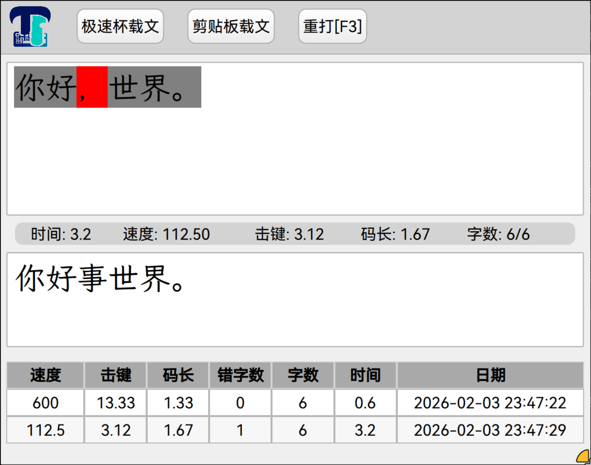
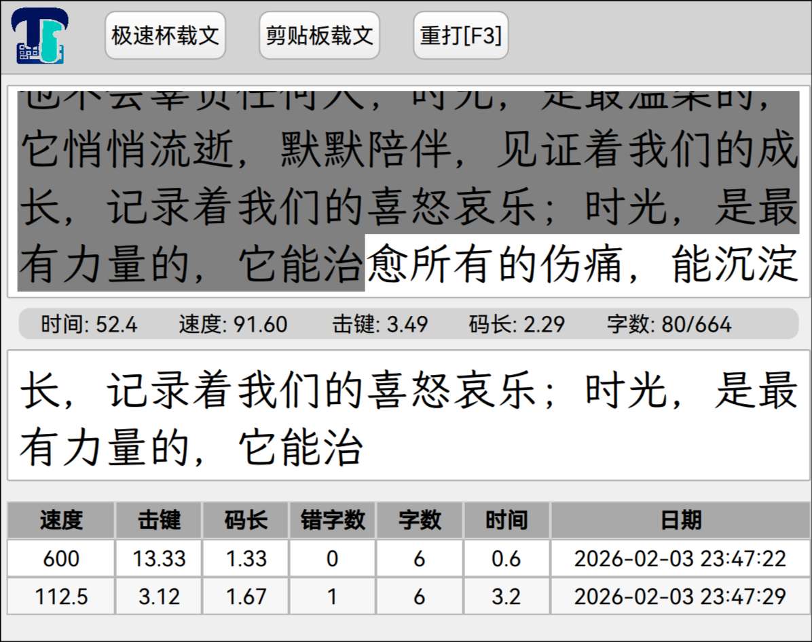

# Typetype

一个基于 PySide6 的打字测试工具，专注于提供流畅的打字体验和实时性能监控。

## 功能特性

- 实时打字速度统计
- WPM（每分钟单词数）计算
- 键盘按键监听
- 网络请求处理（获取赛文/文章）
- 加密功能
- Linux 键盘监听器
- 操作系统和显示服务器自动检测
- Qt/QML 响应式 UI

## 系统要求

- Python 3.12 或更高版本
- Linux 或 Windows 操作系统
- Linux 系统：X11 或 Wayland 显示服务器
- Windows 系统：无需额外配置

## 安装

### 1. 克隆仓库

```bash
git clone <repository-url>
cd typetype
```

### 2. 安装依赖

使用 uv 包管理器：

```bash
uv sync
```

### 3. 运行应用

```bash
uv run python main.py
```

## 打包

### 前置依赖

使用 uv 安装打包所需工具：

```bash
uv pip install pip nuitka
```

### 打包步骤

1. 安装项目依赖：

```bash
uv sync
```

2. 使用 pyside6-deploy 打包：

```bash
pyside6-deploy -c pysidedeploy.spec --extra-ignore-dirs .venv
```

打包完成后，可执行文件将在 `dist/` 目录中。

## 预览





## 项目结构

```
typetype/
├── main.py                    # 应用入口点
├── pyproject.toml             # 项目配置和依赖
├── uv.lock                    # 锁定的依赖
├── .venv/                     # 虚拟环境
├── src/
│   ├── backend/
│   │   ├── Backend.py         # 主要后端逻辑
│   │   ├── Crypt.py           # 加密工具
│   │   ├── GetSaiWen.py       # 网络请求处理
│   │   ├── GlobalKeyListener.py  # Linux 键盘监听器
│   │   ├── SystemIdentyfier.py   # 操作系统和显示服务器检测
│   │   └── text_properties.py    # 文本处理和打字指标
│   └── qml/                   # QML UI 文件
│       ├── Main.qml
│       ├── UpperPane.qml
│       ├── LowerPane.qml
│       └── ...
├── README.md                  # 项目文档
└── AGENTS.md                  # 开发指南
```

## 主要依赖

- `PySide6>=6.10.2` - Qt 应用框架
- `qasync>=0.28.0` - Qt 事件循环集成
- `evdev>=1.9.2` - Linux 设备事件处理
- `httpx>=0.28.1` - HTTP 客户端
- `pycryptodome>=3.23.0` - 加密库

## 开发

### 代码风格

- 使用 snake_case 命名函数和变量
- 使用 PascalCase 命名类
- 函数必须包含类型提示
- 所有导入放在文件顶部
- 类从 `QObject` 继承以实现 Qt 集成

## 许可证

MIT License

## 贡献

欢迎提交 Issue 和 Pull Request！
